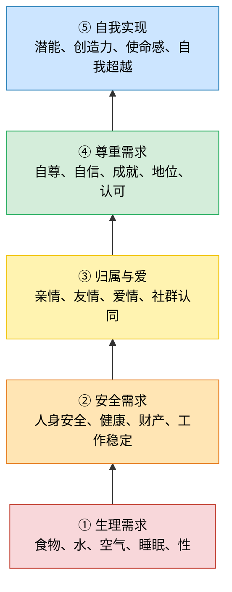

# SSEA 项目原始构想与开放问题

训练方式能否改变，不是喂数据而是其它的方式，但不给数据怎么学习？
一次性输出一个词能否改变？
通过参数权重确定词汇连接的方式能否改变

# 目标

	更优秀的模型架构，减少算力、带宽消耗的同时不会缩减智力，自主联网自主训练去提升自身能力。

设想新架构具有以下特点：
1. 消耗算力少
2. 占用内存带宽少
3. 智力大于等于或略小于当前主流架构
4. 精准回忆历史（或许可以通过类似RAG的方式实现）
5. 自主修改自身代码
6. 自主修改参数权重

设想训练过程如下：
1. 使用新架构从零开始训练模型
2. 模型生存在近乎完善的生态系统中
	1. 系统存在四季变化、生存物资变化、自然灾害等
	2. 系统存在多个模型，代表野兽、同族等互相竞争、合作
3. 系统给予模型生存压力，同时又给予模型偶然的美好能令模型感受到温暖
	1. 生存压力和美好需要定义
	2. 美好可以如马斯洛需求层次理论，更适合人类社会

> 说明：从下往上，通常低层需求相对满足后，高层需求会成为更主要的追求。
1. 系统不设评分函数，只有淘汰函数模拟自然界的演化，人类是观察员

## 模型的训练方式

### 第一代
- 初始给模型“一具身体”，它能够支撑模型在系统中活动
	- 身体如何描述
	- 动作如何描述

### 模型的传代

- ==设计繁衍机制==
- 保存死亡模型的快照，完整保存，完整数据和代码等等
- 有机会繁衍的模型应有类似DNA传递或其它方式，将自身的知识、思想等传递到下一代或内化成类似本能传递到下一代

### 语言的信息密度

人类的自然语言信息密度太低，所以为了令模型在系统中活动，需要更高效的交互形式，即模型绝不能输入/输出自然语言

#### 与生态系统交互的候选语言方案
- 二进制
#### 模型同族之间的交流语言
- 二进制
- 自我演化出同类语言
无论两种中哪一个，人类的语言都是模型为了与外界交流而后天学习的语言，或人类观察需要而主动解码模型语言转换为人类语言。

- 以参数、权重为基础的训练方式必须改变
- 模型的动作、行为等不能使用语言去描写，应有更高效且密度更高的方式
- 若模型以二进制或其它方式交流，人类的知识库似乎全部成为无效数据
- 模型是否能“看”到环境，存在一种类似人类视觉的方式接收环境信息

### 区分“模型架构”和“生态系统”

- 哪些属于模型架构算法，哪些属于生态系统？第一阶段目标是设计模型自身而非一个生态系统
- 身体、动作、繁衍、同族语言(或可模型自主演化)、对世界的感知、模型的大脑（控制模型如何行动）