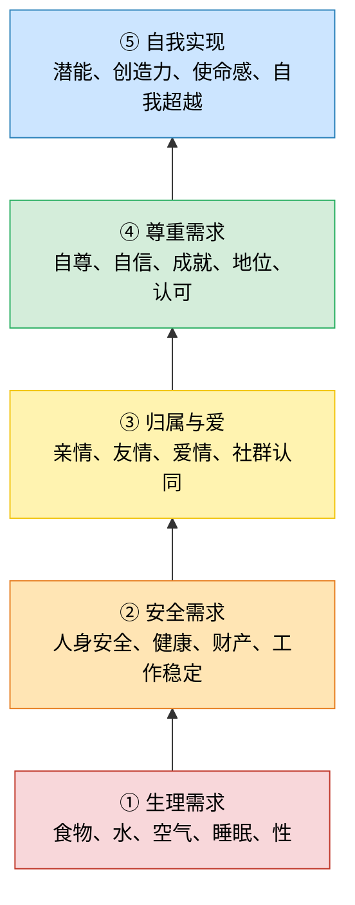

# SSEA 项目原始构想与开放问题

训练方式能否改变，不是喂数据而是其它的方式，但不给数据怎么学习？
一次性输出一个词能否改变？
通过参数权重确定词汇连接的方式能否改变
## 目标

	更优秀的模型架构，减少算力、带宽消耗的同时不会缩减智力，自主联网自主训练去提升自身能力。

设想新架构具有以下特点：
1. 消耗算力少
2. 占用内存带宽少
3. 智力大于等于或略小于当前主流架构
4. 精准回忆历史（或许可以通过类似RAG的方式实现）
5. 自主修改自身代码
6. 自主修改参数权重

设想训练过程如下：
1. 使用新架构从零开始训练模型
2. 模型生存在近乎完善的生态系统中
	1. 系统存在四季变化、生存物资变化、自然灾害等
	2. 系统存在多个模型，代表野兽、同族等互相竞争、合作
3. 系统给予模型生存压力，同时又给予模型偶然的美好能令模型感受到温暖
	1. 生存压力和美好需要定义
	2. 美好可以如马斯洛需求层次理论，更适合人类社会

> 说明：从下往上，通常低层需求相对满足后，高层需求会成为更主要的追求。
1. 系统不设评分函数，只有淘汰函数模拟自然界的演化，人类是观察员

## 具体设计思路

	模型自身+生态系统 == 自然界。尽可能地还原自然界的生态，动物、人类的进化史和自然选择

## 模型

### 第一代
- 初始给模型“一具身体”，它能够支撑模型在系统中活动
	- 身体如何描述
	- 动作如何描述
- 一个现有的算子作为大脑，如GRU、Mamba、Liquid
### 模型的生存

- 不设置评分函数，只有淘汰函数
### 模型的传代

- ==繁衍机制==，包含马斯洛前四个需求
- 有机会繁衍的模型有类似DNA传递或其它的方式，将自身的知识、思想等压缩为本能或龙族传递到下一代或内化成类似本能传递到下一代，类似[[龙族-血脉传承机制]]。允许修改自身代码，类似变异
- 每一个死亡的模型都会被完完整整(数据、代码等等)地保存在外部硬盘，在模型所处世界理解上就是“地府”。这是人类作为观察员记录模型的演化，是生态系统保存它存在过的证明。
	- 说不定现实世界人类死亡之后也会被某个东西保存

### 交互

人类的自然语言信息密度太低，所以为了令模型在系统中活动，需要更高效的交互形式，即模型绝不能输入/输出人类的自然语言

#### 与生态系统交互的候选语言方案
- 二进制
#### 模型同族之间的交流语言
- 二进制
- 自我演化出同类语言
无论两种中哪一个，人类的语言都是模型为了与外界交流而后天学习的语言，或人类观察需要而主动解码模型语言转换为人类语言。

若模型以二进制或其它方式交流，人类就称为了“外星人”，人类的知识库就是模型探索外星文明的过程
### 模型的训练方式

现有的训练方式是预训练把人类的知识库作为一个静态的语料，以transformer这样的算法加上人类知识库计算出静态的权重保存下来，它存在非常多的参数，每个参数都有自己的权重。这些东西是很难被改变的，所以这种训练方式一定要改掉再一个就是容易丢失很多信息。==为什么一定要改变这种方式？寻找理论根基==

- 模型在给出的生态系统中自由活动，生存与其他的捕食者竞争、猎杀，与同族或其他的生物交流合、寻找爱情、繁衍、传承哺育孩子，因而模型可能渐渐他们自己的伦理关系、价值观等，总之是按照人生存的那一套方式翻译过来就是模型训练方式。
- 以参数、权重为基础的训练方式必须改变
- 模型是否能“看”到环境，存在一种类似人类视觉的方式接收环境信息

## 生态系统

	还原自然界的运行规则。一个相对无限的能量源(太阳)，一个产能有限的转化者产出有限的能量(生产者)，一个需要生产者转化后能量的消费者，一些循环的自然资源(水、山、土、矿等等)。

- 自然灾害
- 捕食者
- 疾病(需要设计细菌、病毒？若否，疾病怎么产生？)
- 同族