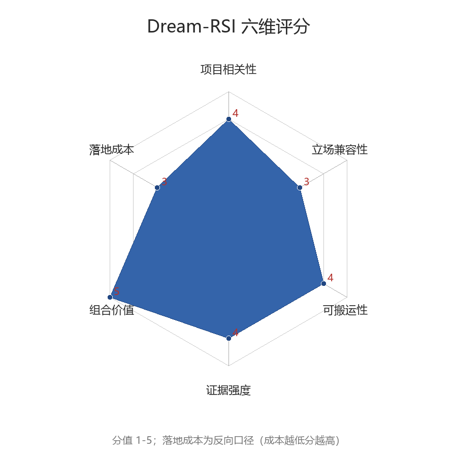

# 论文分析卡片 · Dream-RSI

## 0. 卡片头（速览）

| 项 | 内容 |
|---|---|
| 文件名 | `Dream-RSI.pdf` |
| 标题 | **Dream-RSI: Recursive Self-Improvement through Evolving Worlds** |
| 作者 / 机构 | Tong Zheng 等；Google（含 UMD、Google DeepMind、UVA） |
| 发表时间 / 出处 | 2026，Google（论文标注 © 2026 Google） |
| 论文链接 | 见 PDF 首页；arXiv 编号未在正文标注 |
| 代码链接 | github.com/zhengkid/Dream-RSI；dream-rsi.com |
| 标签 | 递归自改进(RSI) · 元探索 · 经验重放 · 世界模型 · 智能体编排 · 科学发现 |
| **应用裁决** | **A 核心借鉴**（慢环「做梦式」离线验证机制） |
| 优先级 | **P1** |
| 评估日期 / 评估人 | 2026-09-28 / Doubao |

---

## 1. 一句话定位

- **论文主张**：把在线探索积累的**发现历史（discovery tree）当作可重放模拟器**，
  agent 在其中「做梦」——以零执行成本对大量备选探索策略做离线 off-policy 评估，
  再把改进后的策略重新部署在线，形成递归自改进闭环；底层编码代理保持不变（p1、p3）。
- **对 SSEA 的意义**：为**慢环（睡眠期）提案的廉价生成与验证**提供经过实证的机制骨架，
  把「一次在线生存 → 数千次离线评估」变成可能，直接回应自然运行下慢环训练信号稀缺、
  以及实验 2/3「判据量不出差 / 判据形状错」两类债务。

---

## 2. 问题 — 机制 — 证据

### 2.1 论文要解决的问题
- **问题**：自主智能体的递归自改进（RSI）依赖对复杂领域的长程探索，而**探索策略的改进
  （meta-exploration）**是主要瓶颈（p1）。
- **既有方案缺陷**（p2）：
  - 固定的、人工设计的探索策略不能从积累的发现经验中学习，会在无效方向上反复消耗算力；
  - 在线改进探索策略则面临**元级反馈又慢又贵**（每次策略评估可能需要一整轮长程 rollout）
  与**元策略空间庞大**（新策略表现差、需大量试错）的双重困境，自改进环难以在探索层闭合。

### 2.2 核心思想（关键 insight）
1. **History as Replay Simulator**：一个已完成的发现过程天然包含一棵「过去探索决策及其
   实现结果」的结构化树；它一经组织，就是一个**经验重放模拟器**（类比基于模型的 RL 与
   Dreamer），可在不重新运行编码代理/评估器的情况下重放（p2）。
2. 一次昂贵的在线运行，其所有节点结果都已预存，因此可支撑**数千次快速、零执行成本的
   off-policy 评估**（p4）。
3. 自改进应做在**轻量编排层**：让探索显式、可编程，而底层编码代理、评估器、执行接口
   全部固定——只有探索策略代码变化（p3、p4）。

### 2.3 关键机制 / 算法（可独立搬运的「零件」清单）
| 零件 | 输入 → 输出 | 作用 | 出处 |
|---|---|---|---|
| **发现树 Discovery tree** | 初始工作区 → 根 r；每次尝试 → 单父节点 v（存文件快照/产物/诊断/评分 s_v） | 结构化保存全部探索轨迹 | §3 p5 |
| **共享决策接口** | 观测树 T、并行额度 W → 叶节点集合 A(T) 上选一批 C⊆A(T;W) | 在线/离线统一的「下一步开哪些分支」接口 | §3 p5 |
| **在线 rollout** | 策略 π_t、空新树 → 随机生成新子节点（每轮至多 K1 轮、批宽 W） | 产生新的真实经验 | §3 p5 |
| **离线重放 Offline replay** | 固定历史 H_t、候选策略 → 沿树确定性返回已记录子节点 Child(v;T_i,T_i^{m,k})，不产生 T 之外任何结果 | 廉价评估备选策略 | §3 p5–6 |
| **重放目标式 (1)** | 轨迹 → V = 质量 − β1·尝试次数 + β2·并行奖励 | 平衡发现质量/成本/并行度 | Eq.1 p6 |
| **做梦式策略改进** | 固定历史 + M 个策略版本 → 固定策略开发代理逐版修订，候选集含当前版本，取 argmax | 离线改进探索策略代码 | §3 p6 |
| **模拟器池 Simulator pool** | 历轮发现树 → 可复用模拟器集合 | 跨轮积累、扩大可做梦空间 | Fig.1 p2 |

### 2.4 关键表示与数据结构
- 发现树：根 r = 初始工作区；每个非根节点恰有一个 primary parent；节点 = 一次
  生成-评估尝试，继承父节点保存的工作区与历史，记录评分（遵循**固定的任务专用评分
  协议**，分值越大质量越高）与诊断（p5）。
- 合格节点（叶）：A(T) = {r} ∪ {v∈T : v 是叶}；可行批：A(T;W) = {C⊆A(T): |C|≤W}，
  W = 并行 API 调用数（p5）。

### 2.5 实验证据（3 域 8 任务）
| 任务 / 基准 | 对照基线 | 关键数字 | 统计口径 |
|---|---|---|---|
| 算法工程：Lasso 正则路径（SimpleTES，6 个留出数据集） | sklearn/glmnet/SimpleTES/Recursive Fixed Exploration | Gemini-3.1-Pro：317 次代理调用 vs 固定探索 550 次；下游运行时 2931.0ms vs 3587.1ms；Flash：1879 vs 3200，2350.6ms | 累计代理调用数；六数据集平均墙钟运行时（p7–8） |
| 数学优化：Sum-Difference / Circle Packing / Autocorrelation | AlphaEvolve/OpenEvolve/ShinkaEvolve/SimpleTES 等 11 系统 | 1k 生成内：Sum-Diff 1.145427（超 SimpleTES）；Circle Packing 2.635983（并列最优）；Autocorr 1.456375；较 SimpleTES **>50× 预算节省** | 任务专用目标值；生成次数（p9，摘要 p1） |
| GPU 内核工程：KernelBench（VGG16/LayerNorm/ConvDiv/ConvMax） | Recursive Fixed Exploration | VGG16/LayerNorm 同等性能下生成次数少 **2.43×/1.79×**；ConvDiv/ConvMax 同等预算下性能高 **2.09×/1.44×** | 性能 1/ms（需过正确性检查）；生成次数（p10–11） |
| 摘要总览 | — | 代理调用最多较 SimpleTES 减少 **162×**，较固定探索改善 **1.7×**；循环执行次数最多减少 **2.43×** | p1 |

### 2.6 论文自陈局限与边界条件
- 重放只能遍历**已观测树**：重放中策略与在线策略的差异仅在于转移函数——离线确定性返回
  已记录的子节点，**不会产生 T 之外的任何结果**（p5–6）。
- 评分依赖**固定的任务专用评分协议**（p5）；论文未在开放生存/具身域验证。
- §5.1 的边界：把先验轨迹抽象成**高层方向性提示直接注入**，在多线并行探索下反而劣于
  无指导；交互式重放优于仅作指导（p11）。

---

## 3. SSEA 立场对齐（核心维度）

### 3.1 C1–C10 映射
| 裁判标准 | 判定 | 依据 | 若冲突：改造方向 |
|---|---|---|---|
| **C1** 生存控制架构，非语言生成 | ◐ | 域不同（科学发现编排），但「在线探索/离线做梦」交替与 SSEA 快环/慢环双环**结构同构**；Rsi 作用于探索层、不动底层代理（p2–4） | 把编排对象从「发现编码」换为「生存行为」，机制整体平移 |
| **C2** 自然语言只作观察员接口 | ✗→◐ | 固定 **LLM 策略开发代理以语言修订策略代码**，语言在改进环内（p6）；但重放/做梦本身是代码对结构化历史的确定性遍历，不含语言 | 删除 LLM 策略开发代理，以 `ExperienceCompiler` 承担修订；语言只留审计/观察员侧 |
| **C3** 权重/记忆/技能三分离 | ✓ | **范例级**：编码代理（权重）固定；发现历史在外部（记忆）；只改探索策略代码（结构/技能）（p3–4） | — |
| **C4** 低算力低带宽 | ✓ | 离线重放仅读已存记录、**零执行成本**；一次在线运行支撑数千次评估；实测最高省 162× 调用、2.43× 生成（p1、p4） | — |
| **C5** 精准回忆历史 | ✓ | 节点保存精确产物/评分/诊断；离线 Child(·) 为**确定性精确回放**，非近似检索（p5–6） | — |
| **C6** 可自主修改自身 | ◐ | 系统递归修改自身探索策略代码，但修改者是**独立的固定代理**而非本体（p6） | 映射为 ΔS 路径：ExperienceCompiler 提案 → Gate 合法性过滤 → Store 提交 |
| **C7** 可保存/恢复/变异/继承 | ◐ | H_t 跨轮追加、策略版本化、模拟器池积累；但**无跨个体继承、无变异算子**（p5–6） | 发现树/策略版本天然是 GenePackage 素材；继承内容交 HeritableFilter；变异仍需 Gene Manager |
| **C8** 给基因先验，不给知识语料 | ✓ | 发现历史是**自生成经验**而非人类语料，不触 C8；§5.1 实测**高层方向性知识注入会过度约束、多线探索下更差**，为 C8 提供直接实验证据（p11） | — |
| **C9** 不设评分函数，只有淘汰函数 | **✗** | 固定评分 s_v + 式(1) 加权目标（质量−成本+并行奖励）+ **argmax 选策略**，是显式评分排序（p5–6） | s_v 只能作为**环境侧事实**（类比 `Feedback.energy_change`）；模型内不设排序分；选择改由「合法性门 + 模型外淘汰」；式(1) 仅留 experiments 仪器侧 |
| **C10** 创新在 L2/L3/L4，不在 L1 算子 | ✓ | 创新全在编排层（探索显式化/共享接口）= L2，离线策略改进 = L3；未发明新算子（p3–6） | — |

### 3.2 L1–L4 层级定位
| 层次 | 论文在该层提供了什么 | 对 SSEA 的价值 |
|---|---|---|
| **L1 算子层** | 无新算子，编码代理/评估器全部固定 | 符合「L1 借用」立场 |
| **L2 信息流层** | 探索显式化、共享决策接口、在线/离线双相、模拟器池 | **高**：可直接丰富双环与注入面语义 |
| **L3 学习层** | 做梦式离线策略改进、重放目标、自适应探索（§5.2） | **高**：为慢环 ΔS 提供廉价提案-验证回路 |
| **L4 演化层** | 版本化历史、可序列化发现树（但无继承/变异） | 中：为 GenePackage 提供内容与格式参照 |

### 3.3 模块映射
| 论文构件 | SSEA 落点 |
|---|---|
| 发现树 | `memory_system.py` 的经验组织表示；`ExperienceCompiler` 输入 |
| 重放模拟器 + 模拟器池 | **新增建议 `ReplaySimulator`**：ExperienceCompiler 下游、VerificationGate 的廉价前置验证面 |
| 做梦式策略改进 | `experience_compiler.py`（ΔS 提案）+ `verification_gate.py`（离线合法性/可行性过滤） |
| 共享决策接口 A(T;W)、批选择 | 慢环批选择协议；与 `skill_runner` 批处理对接 |
| 在线随机 / 离线确定性双相 | `fast_loop.py` / 慢环职责划分的语义参照 |
| 策略开发代理 | **不引入**，由 ExperienceCompiler 替代（C2） |
| 式(1) 重放目标 | **不进模型**；仅在 `experiments/` 仪器侧作研究者分析工具（C9） |
| 发现树/策略版本序列化 | `sse_protocols/gene.py`、Gene Manager save/load 的内容参照 |

### 3.4 债务与验收实验对应
- **债务 26**（实验 2 判据量不出差、实验 3 判据形状错、0/33 SKILL_FAILURE）：重放可在
  **已记录状态上廉价测试大量备选**，并把技能 `precondition` 的「描述」与「判据」分开检验
  ——正对实验 3「precondition 被当成判据、要求复现自身峰值」的病因。
- **自然运行下慢环提案分母为 0、训练信号稀缺**（README 证据现状）：一次在线运行→数千次
  离线评估，直接缓解。
- **记忆门选择性缺失（参数侧 Δθ 未做）**：§5.2 自适应模式（便宜时少试、停滞时加力）
  为「惊奇帧开、平淡帧关」提供机制类比。
- **Gene Manager 缺失 / DeathHook 未接**：可序列化发现树为基因包与死亡快照提供格式参照。
- 可服务**实验 7（睡眠期编译）的增强**或新增「梦境重放」实验。

---

## 4. 可借鉴资产清单

| # | 资产 | 类型 | 搬运方式 | 落点模块 | 预期解决的问题 | 置信度 |
|---|---|---|---|---|---|---|
| 1 | 「历史即重放模拟器」思想 | 思想 | 改造移植 | 慢环 | 离线提案验证无需重跑环境 | 高 |
| 2 | 发现树表示（根/单父/节点=尝试/固定字段） | 表示 | 改造移植 | memory_system + sse_protocols | 经验结构化、可回放 | 高 |
| 3 | 在线随机生成 vs 离线确定性 Child() 双相语义 | 协议 | 改造移植 | fast/slow loop | 双环职责清晰化 | 高 |
| 4 | 候选集含当前策略、无改进不切换的纪律 | 思想 | 直接移植（合法性版） | verification_gate / structure_store | 保持「不劣于现状」 | 高 |
| 5 | 共享决策接口 A(T;W)、批选择 C | 协议/算法 | 改造移植 | 慢环 / skill_runner | 并行度显式可控 | 中 |
| 6 | 失败四分类（hard-unrecoverable / repairable / weak-but-underexplored / shared-resource） | 提示设计→分类信号 | 改造为非语言分类 | ExperienceCompiler / Gate | 提案驳回理由结构化（Listing 2, p19–20） | 中 |
| 7 | §5.1 强语义先验过度约束的证据 | 证据 | 直接引用 | 支撑 C8 决策 | 抵制知识注入 | 中 |
| 8 | §5.2 成本/停滞响应的自适应探索 | 机制 | 仅借思想 | 记忆门控 / plasticity | 选择性 Δθ 类比 | 中 |
| 9 | 式(1) 重放目标 | 算法 | **仅仪器侧**（C9） | experiments | 帕累托曲线/判据形状设计 | 中 |
| 10 | 开源实现 | 工程实现 | 参考 | 原型 | 加速落地 | 中 |

---

## 5. 冲突、代价与风险

- **C9 硬冲突**：式(1) 与 argmax 选择若随机制一起进入模型，等于在模型内长出评分函数，
  **架构变质**。必须保证：环境给事实、Gate 只判合法性、选择在模型之外。
- **C2 风险**：若保留 LLM 策略开发代理，自然语言重新进入控制闭环。
- **重放覆盖域有限**：不产生 T 之外的结果，纯重放导向**保守化、可能冻结创新**；必须保留
  在线探索与淘汰压力（必要时组合生成式世界模型，见 §6）。
- **评分协议假设**：论文任务都有良定义评分；SSEA 只有淘汰函数，映射不显然，需自行设计。
- **域迁移未被证明**：证据全部来自代码/科学发现，非具身生存；机制是否有效需自测。
- **存储代价**：模拟器池跨轮膨胀，与 C4 存在张力，需池修剪/压缩策略。

---

## 6. 组合分析

### 6.1 关系图谱
| 关系 | 对象 | 说明 |
|---|---|---|
| 前置依赖 | 环境事实反馈（`environment.py` + 淘汰函数）、JSON 序列化、VerificationGate | SSEA 均已具备 |
| 互补 | 生成式世界模型族：**World Models(2018)/Dreamer/Genie(2024)** | 经验重放精确但只覆盖已观测；生成模型可想象未见但会幻觉 |
| 互补 | 技能库族：**Voyager / SkillWeaver / Inducing Programmatic Skills / Evolving Programmatic Skill Networks / SkillRL** | 发现树叶=候选技能；重放提供入库前廉价验证，正对实验 3 的 0/33 |
| 互补 | 语言自改进族：**STaR / Reflexion / ReST-MCTS / SELF / R-Zero** | 用「代码重放反馈」替换「口头/语言反馈」，合 C2 |
| 互补 | 树搜索族：**LATS / AlphaZero-like tree search / MindSearch / LiteSearch** | 发现树即共享树接口，重放=真实历史树上的免执行评估 |
| 互补 | 记忆族：**A-MEM / Mem0 / SEDM / MemGen / G-Memory** | 发现树=结构化记忆组织，重放=精确回忆（C5） |
| 替代 | 固定/人工探索策略、纯语言反思（Reflexion 式 verbal RL） | 以可学习的离线重放策略替换 |

### 6.2 推荐组合方案
1. **重放约束的梦境（本篇 + Genie/Dreamer 族）**
   - 接口：Child() 查得到延续 → 走确定性重放；查不到 → 调用生成式世界模型 rollout，
     结果须经后续在线/重放校验。
   - 新增能力：在未观测空间产生候选，同时已观测区保持零幻觉。
   - 风险：生成幻觉在 C9 下的校验责任必须落在 Gate/环境，模型不自评。
2. **技能-验证闭环（本篇 + 技能库族）**
   - 形态：技能候选 → 重放模拟器在记录状态上检验前置条件与效果 → 通过才入 SkillLibrary。
   - 直接修复实验 3：把「描述性 precondition」与「重放判据」分离，避免「复现自身峰值」。
3. **重放式树搜索（本篇 + LATS/AlphaZero-like）**
   - 在真实历史树上做免执行扩展与评估；选择规则须外置或合法性化（C9）。

### 6.3 本篇在组合中的典型角色
- **廉价离线验证 / 反馈枢纽件**：一端接在线经验（记忆），一端向技能库、树搜索、
  策略改进供给经过事实验证的反馈。

---

## 7. 多维度评分（1–5）

| 维度 | 分值 | 评分理由 |
|---|---|---|
| 项目相关性 | **4** | 双环交替/离线做梦/递归自改进与 SSEA 慢环高度同构；域不同（科学发现 vs 生存）扣 1 分（推断） |
| 立场兼容性 | **3** | C3/C4/C5/C10 强支持、C8 得实证助攻；但 C9 评分+argmax、C2 LLM 在环为两处硬冲突（实测于原文） |
| 可搬运性 | **4** | 编排层轻量、底层不动的哲学与注入面一致；发现树/重放可在只依赖标准库的协议层干净实现；已开源 |
| 证据强度 | **4** | 3 域 8 任务、含受控基线、数字显著；但无生存/具身域证据，收益部分依赖任务专用评分协议 |
| 组合价值 | **5** | 天然枢纽，可与世界模型/技能库/树搜索/记忆/自改进五族组合 |
| 落地成本 | **3** | 重放本身实现成本低；C9 改造与「选择规则」重设计、以及新证据实验是主要成本（反向口径） |

---

## 8. 裁决与下一步

- **应用等级：A 核心借鉴** —— 它给出的不是单个算法，而是慢环「在线生存 → 离线做梦 →
  版本切换」的完整机制，且与 SSEA 的三分离、双环、注入面天然对齐。
- **优先级：P1**（P0 为当前债务 26 修复；本项可在其完成后立即接入，亦可并行原型）。
- **建议动作**：
  1. 在 `sse_protocols` 增加经验轨迹/发现树协议（或确认 memory 协议可承载）；
  2. 实现 `ReplaySimulator` 原型：从落库记忆构建、确定性 Child() 遍历；
  3. ExperienceCompiler 增加「做梦提案」路径：重放内生成多个 ΔS 候选 → Gate 合法性过滤；
  4. 式(1) 仅在 `experiments/` 仪器侧实现，禁止进入模型代码；
  5. 加变异测试守卫：扫描模型内任何排序/打分入口（守 C9）。
- **最小验证实验（建议编号实验 8「梦境重放」，扩展实验 7）**：
  - 双臂：做梦重放 开 / 关；≥8 个固定 seed；
  - 判据三档：机制计数（提案数/通过率，**先看分母：自然运行下的提案数**）→
    逐帧动作差（沿用债务 21 第三档判据）→ 生存差分由**模型外淘汰函数**给出；
  - 预期：离线评估次数/在线帧数比显著增大；证伪条件：若行为无差异，按纪律**先怀疑尺子**，
    不得直接读作「机制无效」。

---

## 9. 待确认问题

1. **C9 下如何替代 argmax 选择、同时保留「不劣于现状」保证？** 候选集含当前版本 +
   合法性门只能保证「不破坏」，保证不了「选得好」；选择是否应推迟到生态阶段的种群淘汰？
   第一阶段是否需要确定性的「应用/不应用」规则？（需作者决策）
2. 重放模拟器内容属 **L3 个体记忆**还是 **L4 可遗传物**？HeritableFilter 的筛选规则？
3. 多大比例慢环提案可被重放验证、多少必须在线检验？
4. 模拟器池修剪/压缩策略（存储膨胀 vs C4）？
5. 是否需要生成式世界模型补全未观测空间（组合方案 1）？其幻觉在 C9 下如何控制？

---

## 附：关键摘录与出处

| 摘录 | 页码 |
|---|---|
| “accumulated discovery history can serve as a replay simulator over the discovered search space” | p1 |
| Fig.1 三阶段：Online Explore → Construct Replay Simulator → Dreaming-based Policy Improvement | p2 |
| “a single costly online discovery run enables thousands of rapid, zero-execution-cost off-policy evaluations” | p4 |
| 离线重放“no outcomes beyond T are generated” | p5–6 |
| Eq.1：V = 发现质量 − β1·执行成本 + β2·并行奖励 | p6 |
| §5.1：方向性提示在多线探索下过度约束；交互式重放优于仅作指导 | p11 |
| §5.2：探索策略随轮次自适应（少试→停滞加力），与性能回升同步 | p11 |
